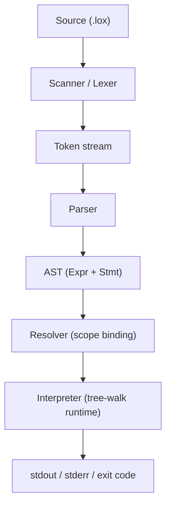

# Litecode

Litecode is a from-scratch interpreter project inspired by [Crafting Interpreters](https://craftinginterpreters.com/) by Robert Nystrom.

Current implementation is a **C++17 tree-walk interpreter** with scanner, parser, resolver, and runtime fully connected. The long-term goal is to continue into a **C-based bytecode VM path**.

This root README is the **high-level guide** for the entire project.
Detailed deep-dives are split into per-module READMEs.

---

## What This Project Is

Litecode is a learning-focused language implementation project that helps you understand:
- lexical analysis (scanner)
- parsing and AST construction
- static scope resolution
- runtime interpretation
- functions, closures, classes, inheritance

If you are a beginner, this repo is meant to be read layer-by-layer.

---

## Documentation Map

Read in this order:

1. **Project overview (this file)**
2. [Lexer Deep Dive](lexer/README.md)
3. [Parser + AST Deep Dive](parser/README.md)
4. [Resolver Deep Dive](resolver/README.md)
5. [Interpreter Runtime Deep Dive](interpreter/README.md)
6. [Testing Guide](tests/README.md)
7. [Current status snapshot](docs/PROJECT_STATUS.md)

---

## High-Level Architecture



Core execution order in `main.cpp`:
1. Scan source into tokens.
2. Parse tokens into statements AST.
3. Resolve lexical scope/static constraints.
4. Execute with interpreter.

---

## Repository Layout

```text
litecode/
  lexer/         # scanner/tokenization module + docs
  parser/        # AST + recursive descent parser + docs
  resolver/      # lexical scope resolver + docs
  interpreter/   # runtime/evaluator + docs
  tests/         # unit and integration tests + docs
  scripts/       # smoke/regression scripts
  docs/          # status documents
  main.cpp       # entrypoint (file mode + REPL)
```

---

## Implemented Language Features

- Literals: `nil`, booleans, numbers, strings
- Expressions: arithmetic, comparison, equality, unary, logical operators
- Statements: `print`, `var`, block, `if/else`, `while`, `for`, `return`
- Functions: declarations, calls, closures, recursion
- Classes: instances, fields, methods, `this`, inheritance, `super`
- Native function: `clock()`

For detailed semantics and examples, see [interpreter/README.md](interpreter/README.md).

---

## Build and Run

### Prerequisites
- CMake 3.16+
- C++17 compiler

### Build

```bash
cmake -S . -B build
cmake --build build -j
```

### Run a script file

Use a `.lox` source file when you want to execute a complete program in one shot:

```bash
./build/litecode path/to/file.lox
```

This is the recommended way to run finished programs and is the default product workflow for file-based validation.

### Run the REPL

Use the interactive prompt when you want to type Lox code line by line:

```bash
./build/litecode
```

REPL commands:
- `.help` shows available commands
- `.reset` clears the current interpreter state
- `.quit` exits the prompt

REPL helper command:
- `.reset` clears current REPL state (variables/functions/classes) and frees retained session AST state.
- optional env knob: `LITECODE_REPL_AUTO_RESET_EVERY=<N>` auto-resets REPL state after every `N` successful inputs (default disabled).

### Debug toggles

```bash
LITECODE_DUMP_TOKENS=1 ./build/litecode sample.lox
LITECODE_DUMP_AST=1 ./build/litecode sample.lox
```

---

## Testing and Validation

### Full test suite

```bash
ctest --test-dir build --output-on-failure
```

### Smoke checks

```bash
./scripts/regression_smoke.sh ./build/litecode
```

Detailed test documentation: [tests/README.md](tests/README.md)

---

## Exit Codes and Error Model

- `64`: command usage error
- `65`: language error (lex/parse/resolve/runtime)
- `66`: file input error (for example missing script)

---

## Progress vs Crafting Interpreters

Current state aligns approximately through late `jlox` chapters:
- scanning, parsing, expressions/statements, control flow
- functions and closures
- resolver and lexical binding
- classes and inheritance (`this`/`super`)

Progress details: [docs/PROJECT_STATUS.md](docs/PROJECT_STATUS.md)

---

## Known Tradeoffs

- REPL keeps AST batches alive for safe function/class pointer lifetimes; long sessions can grow memory.
- No garbage collector yet (smart pointers currently handle ownership).
- Internal naming has a few intentional differences (for example `NILL`, `LEFT_PARENTH`) but is consistent.

---

## Roadmap Direction

### Short-term
- tighten diagnostics and polish docs/examples
- expand targeted edge-case tests

### Mid-term
- improve REPL memory strategy while preserving correctness

### Long-term
- start C bytecode VM branch (stack, chunks, opcodes, VM loop)

---

## External References

- [Crafting Interpreters](https://craftinginterpreters.com/)
- [The Lox language (book chapter)](https://craftinginterpreters.com/the-lox-language.html)
- [A Tree-Walk Interpreter (book chapter)](https://craftinginterpreters.com/a-tree-walk-interpreter.html)
- [CMake tutorial](https://cmake.org/cmake/help/latest/guide/tutorial/index.html)
- [GoogleTest docs](https://google.github.io/googletest/)

---

## License

See [LICENSE](LICENSE).
