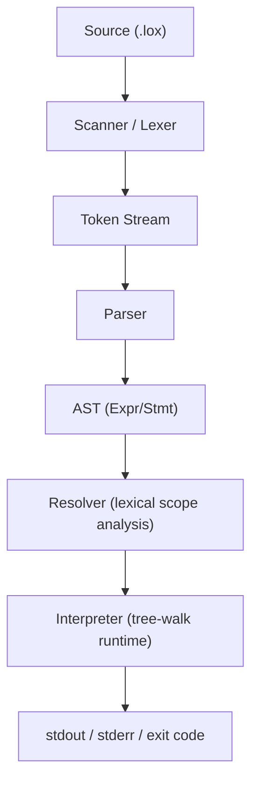
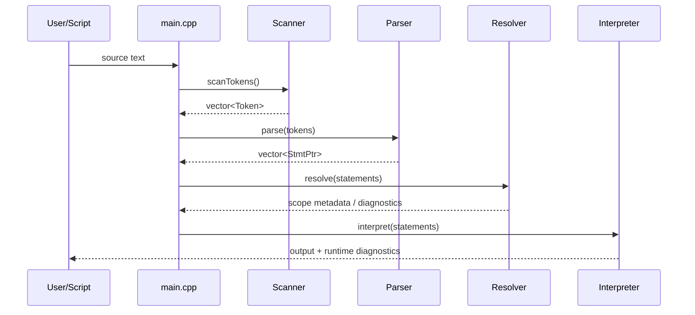

# Litecode: A Beginner-Friendly C++ Interpreter Project

Litecode is a from-scratch interpreter project inspired by [Crafting Interpreters](https://craftinginterpreters.com/) by Robert Nystrom.

It currently implements a substantial **tree-walk interpreter** for a Lox-like language in **C++17**, and is designed to later add a **C-based bytecode VM** track.

This README is intentionally long and structured like a beginner handbook:
- start with the big picture,
- gradually move to details,
- connect concepts across scanner, parser, resolver, and runtime,
- explain not only *what* the code does, but *why* the design exists.

---

## Table of Contents

1. [Why This Project Exists](#1-why-this-project-exists)
2. [Who This README Is For](#2-who-this-readme-is-for)
3. [Current Status at a Glance](#3-current-status-at-a-glance)
4. [Quick Start](#4-quick-start)
5. [Your First Litecode Program](#5-your-first-litecode-program)
6. [Language Features Implemented So Far](#6-language-features-implemented-so-far)
7. [How the Interpreter Works (High Level)](#7-how-the-interpreter-works-high-level)
8. [Architecture and Code Layout](#8-architecture-and-code-layout)
9. [Execution Flow: File Mode and REPL](#9-execution-flow-file-mode-and-repl)
10. [Lexer (Scanner) Deep Dive](#10-lexer-scanner-deep-dive)
11. [Parser and AST Deep Dive](#11-parser-and-ast-deep-dive)
12. [Resolver Deep Dive (Static Scope Analysis)](#12-resolver-deep-dive-static-scope-analysis)
13. [Interpreter Runtime Deep Dive](#13-interpreter-runtime-deep-dive)
14. [Functions, Closures, and Environments](#14-functions-closures-and-environments)
15. [Classes, Instances, `this`, and `super`](#15-classes-instances-this-and-super)
16. [Errors, Diagnostics, and Exit Codes](#16-errors-diagnostics-and-exit-codes)
17. [Testing and Validation](#17-testing-and-validation)
18. [Progress vs Crafting Interpreters](#18-progress-vs-crafting-interpreters)
19. [Project Conventions and Naming Notes](#19-project-conventions-and-naming-notes)
20. [Known Gaps / Tradeoffs](#20-known-gaps--tradeoffs)
21. [Next Milestones](#21-next-milestones)
22. [Suggested Learning Path Through This Codebase](#22-suggested-learning-path-through-this-codebase)
23. [External References](#23-external-references)
24. [License](#24-license)

---

## 1) Why This Project Exists

The original book uses Java for the first interpreter (`jlox`) and C for the second VM (`clox`).
This project follows that spirit, but with a custom learning path:
- **C++** for the tree-walk interpreter phase,
- **C** planned for low-level bytecode/VM work later.

Why this is useful:
- You learn language implementation fundamentals independent of host language.
- You understand tradeoffs in memory, ownership, and runtime behavior.
- You build confidence by implementing each phase end-to-end.

---

## 2) Who This README Is For

This document is written for:
- complete beginners to interpreters,
- C/C++ learners who want compiler/interpreter internals,
- readers following *Crafting Interpreters* and wanting a C++ mapping.

If you are new, don’t try to read every section at once. Start with:
1. Quick Start
2. High-Level Flow
3. Lexer + Parser sections
4. Runtime sections

---

## 3) Current Status at a Glance

Implemented and working:
- Scanner (lexer)
- AST definitions for expressions/statements
- Recursive-descent parser
- Resolver for lexical scope analysis + static semantic checks
- Tree-walk interpreter runtime
- Functions, closures, classes, inheritance, `this`, `super`
- Native function: `clock()`
- Unit + integration tests via CTest/GTest
- CI on GitHub Actions (Ubuntu + macOS)

Current maturity: roughly a **late jlox baseline (through inheritance)**.

---

## 4) Quick Start

### Prerequisites

- CMake 3.16+
- A C++17 compiler (`clang++` or `g++`)
- `make`/Ninja backend supported by CMake

### Build

```bash
cmake -S . -B build
cmake --build build -j
```

### Run a script file

```bash
./build/litecode path/to/file.lox
```

### Run interactive REPL

```bash
./build/litecode
```

### Run all tests

```bash
ctest --test-dir build --output-on-failure
```

### Optional debug dumps

Dump scanned tokens:

```bash
LITECODE_DUMP_TOKENS=1 ./build/litecode sample.lox
```

Dump printed AST:

```bash
LITECODE_DUMP_AST=1 ./build/litecode sample.lox
```

---

## 5) Your First Litecode Program

Create `hello.lox`:

```lox
print "Hello, Litecode!";
print 1 + 2 * 3;
```

Run:

```bash
./build/litecode hello.lox
```

Expected output:

```text
Hello, Litecode!
7
```

---

## 6) Language Features Implemented So Far

### Data and literals
- `nil`, booleans (`true`, `false`), numbers, strings

### Expressions
- Arithmetic: `+ - * /`
- Comparisons: `> >= < <= == !=`
- Unary: `! -`
- Grouping: `( ... )`
- Assignment
- Logical operators: `and`, `or`

### Statements
- Expression statements
- `print`
- `var` declarations
- Block scope `{ ... }`
- `if / else`
- `while`
- `for` (desugared internally to `while`)
- `return`

### Functions
- Function declarations `fun name(params) { ... }`
- Function calls with arity checking
- Closures
- Recursion

### Object system
- Class declarations
- Instance fields/properties
- Methods
- `this`
- Inheritance with `<`
- `super.method()` dispatch
- Initializer semantics (`init`)

### Native functions
- `clock()` (returns epoch seconds as number)

---

## 7) How the Interpreter Works (High Level)

Execution pipeline:

```text
Source Code
   |
   v
Scanner (tokens)
   |
   v
Parser (AST)
   |
   v
Resolver (scope distances + static checks)
   |
   v
Interpreter (execute/evaluate)
```

The resolver is a critical step. It computes lexical distances so runtime variable lookup is fast and correct for closures.



---

## 8) Architecture and Code Layout

```text
litecode/
  lexer/
    inc/   -> token and scanner interfaces
    src/   -> scanner implementation
  parser/
    inc/   -> AST node definitions + parser API
    src/   -> parser + AST printer
  resolver/
    inc/   -> resolver API
    src/   -> static scope resolution
  interpreter/
    inc/   -> runtime types (Environment, callable model)
    src/   -> evaluator/executor/runtime objects
  tests/
    cases/ -> integration test cases (input/output/exit)
    unit/  -> GTest unit tests
  scripts/
    regression_smoke.sh
  main.cpp
  CMakeLists.txt
```

### CMake targets

- `litecode_core` (library): lexer + parser + resolver + interpreter
- `litecode` (executable): CLI/REPL entrypoint
- `litecode_unit_tests` (executable): GTest unit suite

---

## 9) Execution Flow: File Mode and REPL

`main.cpp` behavior:
- If one argument is passed, run in **file mode**.
- If no argument is passed, run in **prompt/REPL mode**.

### Per-input run stages
1. Reset lexer error reporter.
2. Scan source into tokens.
3. Parse tokens into statement AST nodes.
4. Resolve lexical bindings/static checks.
5. Interpret statements.



### REPL persistence behavior
The interpreter instance and parsed batches are retained across prompt inputs so definitions persist across lines. This enables:
- defining a function in one input,
- calling it in a later input.

Tradeoff: AST batches are retained, so very long sessions can grow memory.

---

## 10) Lexer (Scanner) Deep Dive

### What is lexing?

Lexing converts a plain string into a stream of structured tokens.
Example:

```lox
print 1 + 2;
```

becomes roughly:

```text
PRINT NUMBER PLUS NUMBER SEMICOLON EOF
```

### Responsibilities of current scanner

- Skips whitespace and comments (`// ...`)
- Tracks line numbers
- Recognizes:
  - single-char tokens (`(`, `)`, `{`, `}`, `.`, `,`, etc.)
  - two-char operators (`!=`, `==`, `<=`, `>=`)
  - strings
  - numbers with optional fractional part
  - identifiers/keywords

### Keyword note
The language keyword is `nil`, but internal token enum uses `NILL` by project convention. This is consistent in the codebase.

### Error handling
Unexpected characters and unterminated strings are reported with line info and set language error state.

---

## 11) Parser and AST Deep Dive

### What is parsing?

Parsing consumes tokens and builds an **AST (Abstract Syntax Tree)**.
AST captures structure and precedence explicitly.

Example:

```lox
print 1 + 2 * 3;
```

AST representation preserves precedence (`*` before `+`).

### Parser style
- Recursive descent
- Precedence implemented by function layering:
  - assignment
  - logical or/and
  - equality/comparison
  - term/factor
  - unary
  - call/primary

### Statement parsing support
- declarations: `class`, `fun`, `var`
- statements: `if`, `for`, `while`, `return`, `print`, block, expression

### `for` desugaring
`for` loops are translated into equivalent `while` AST structure during parsing.

### Recovery strategy
On parse error, parser synchronizes to a safe point so subsequent declarations can still be parsed.

---

## 12) Resolver Deep Dive (Static Scope Analysis)

### Why a resolver exists

Without resolution, closures and nested scopes can bind wrong variables.
Resolver determines **which declaration each variable expression refers to** before runtime.

It records `Expr* -> depth` mappings, where `depth` is number of environment hops from current scope.

### What resolver checks

- top-level `return` is invalid
- reading a local variable inside its own initializer is invalid
- duplicate local declarations in same scope are invalid
- `this` outside class is invalid
- `super` outside class is invalid
- `super` in class without superclass is invalid
- class cannot inherit from itself
- initializers cannot return explicit values

### Resolver + interpreter contract

Resolver annotates expression nodes with distances.
Interpreter uses `Environment::getAt()` / `assignAt()` with those distances.

---

## 13) Interpreter Runtime Deep Dive

The runtime is a tree-walk evaluator/executor.

### Value model
`Value` is currently a `std::variant` containing:
- `nullptr_t` (nil)
- `bool`
- `double`
- `std::string`
- callable objects
- class instances

### Runtime semantics
- Truthiness: `nil` and `false` are falsey, others truthy
- Equality: compares matching variant types
- `+`: number+number or string+string only
- Numeric operators require numeric operands

### Native function bootstrap
At interpreter construction, global environment defines `clock`.

---

## 14) Functions, Closures, and Environments

### Environment chain

Each scope maps names to runtime values and points to an enclosing environment.
Lookup climbs outward if not found locally.

### Closures

A function captures the environment where it is declared.
When later called, it executes with a fresh call environment enclosing that captured scope.

This is what makes lexical closure behavior possible.

### Return handling

`return` is implemented with a dedicated control-flow signal object (`ReturnSignal`) unwound through execution.

---

## 15) Classes, Instances, `this`, and `super`

### Object model

- `LoxClass` is callable (class call constructs instance)
- `LoxInstance` holds fields and method binding behavior
- Methods are `LoxFunction` values bound to instance as `this`

### Initializers

- Method named `init` acts as initializer
- Arity of class call mirrors `init` arity
- Initializer always returns the instance (`this`), even if function body returns explicitly

### Inheritance and super

- Class can declare superclass via `<`
- Method lookup walks superclass chain
- `super.method()` resolves and binds method on current instance

---

## 16) Errors, Diagnostics, and Exit Codes

### Error categories

- Lex/parse/resolver/runtime language errors: process exits with `65` in file mode
- File I/O failures (e.g. missing script file): exits with `66`
- CLI usage errors: exits with `64`

### Why this matters
Clear exit codes make the interpreter script-friendly and easier to automate in tests.

---

## 17) Testing and Validation

Testing uses three layers:

1. **Unit tests** (GTest)
- scanner behavior
- parser + resolver checks
- interpreter behavior
- environment operations

2. **Case-based integration tests** (`tests/cases/*`)
- each test case contains:
  - `input.lox`
  - `expected.out`
  - `expected.err`
  - `expected.exit`

3. **Smoke script** (`scripts/regression_smoke.sh`)
- end-to-end command-level sanity checks
- debug toggle checks
- error path checks

### Run test suite

```bash
ctest --test-dir build --output-on-failure
```

### Run smoke checks

```bash
./scripts/regression_smoke.sh ./build/litecode
```

### CI
GitHub Actions workflow runs configure/build/test on:
- `ubuntu-latest`
- `macos-latest`

---

## 18) Progress vs Crafting Interpreters

Approximate mapping:
- Ch 4 Scanning: implemented
- Ch 5 Representing Code: implemented for current syntax
- Ch 6 Parsing Expressions: implemented
- Ch 7 Evaluating Expressions: implemented
- Ch 8 Statements and State: implemented
- Ch 9 Control Flow: implemented (`for` desugaring included)
- Ch 10 Functions: implemented
- Ch 11 Resolving and Binding: implemented
- Ch 12 Classes: implemented
- Ch 13 Inheritance: implemented

Practical interpretation: current code is around late `jlox` capability.

---

## 19) Project Conventions and Naming Notes

A few internal names intentionally differ from the book’s exact identifiers. Example:
- token enum uses `NILL` internally while source language keyword remains `nil`
- token name `LEFT_PARENTH` instead of `LEFT_PAREN`

These are not semantic differences, just naming conventions in this codebase.

---

## 20) Known Gaps / Tradeoffs

1. REPL memory growth over long sessions
- Statement batches are retained to preserve function/method AST lifetime safety.

2. No garbage collector yet
- Current runtime ownership uses smart pointers.

3. jlox-level polish still possible
- More diagnostics and richer native library can be added.

4. Bytecode VM not started yet
- Planned next phase in C.

---

## 21) Next Milestones

### Milestone A: Stability and ergonomics
- improve diagnostics consistency
- consider bounded REPL AST retention strategy
- add more edge-case tests

### Milestone B: C bytecode VM bootstrap
- define bytecode chunk/value stack/opcodes
- create VM execution loop
- port arithmetic/globals path first
- later add call frames, closures, classes

---

## 22) Suggested Learning Path Through This Codebase

If you are a beginner, follow this order:

1. `main.cpp`
- understand the full pipeline

2. `lexer/inc/*` + `lexer/src/Scanner.cpp`
- understand tokenization and line-aware errors

3. `parser/inc/Expr.hpp` + `parser/inc/Stmt.hpp`
- understand AST data model

4. `parser/src/Parser.cpp`
- understand recursive descent and precedence

5. `resolver/src/Resolver.cpp`
- understand static scope binding

6. `interpreter/src/Environment.cpp`
- understand lexical environment chain

7. `interpreter/src/Interpreter.cpp`
- understand runtime semantics and execution

8. `interpreter/src/LoxCallable.cpp`
- understand closures, classes, method binding

9. `tests/`
- see behavior-driven examples

This order mirrors language implementation layers and minimizes confusion.

---

## 23) External References

Core references:
- [Crafting Interpreters (free online book)](https://craftinginterpreters.com/)
- [jlox introduction chapter](https://craftinginterpreters.com/a-tree-walk-interpreter.html)
- [The Lox language overview](https://craftinginterpreters.com/the-lox-language.html)

C++ references:
- [cppreference: `std::variant`](https://en.cppreference.com/w/cpp/utility/variant)
- [cppreference: smart pointers](https://en.cppreference.com/w/cpp/memory)
- [CMake official tutorial](https://cmake.org/cmake/help/latest/guide/tutorial/index.html)

Testing references:
- [GoogleTest documentation](https://google.github.io/googletest/)
- [CTest documentation](https://cmake.org/cmake/help/latest/manual/ctest.1.html)

If you are studying language implementation broadly:
- [Dragon Book (classic)](https://en.wikipedia.org/wiki/Compilers:_Principles,_Techniques,_and_Tools)
- [Parsing techniques overview](https://en.wikipedia.org/wiki/Recursive_descent_parser)

---

## 24) License

This project is licensed under the terms in [LICENSE](LICENSE).

---

## Appendix: Concept Quick Glossary

- **Token**: categorized lexical unit produced by scanner.
- **AST**: tree representation of program structure.
- **Recursive descent parser**: hand-written parser where each grammar rule is a function.
- **Resolver**: pre-runtime analysis pass that binds variable uses to declarations.
- **Environment**: runtime scope map for variables.
- **Closure**: function carrying captured lexical scope.
- **Tree-walk interpreter**: executes by recursively traversing AST.
- **Desugaring**: translating syntax (`for`) into simpler core syntax (`while`).
- **Arity**: number of arguments expected by a callable.
