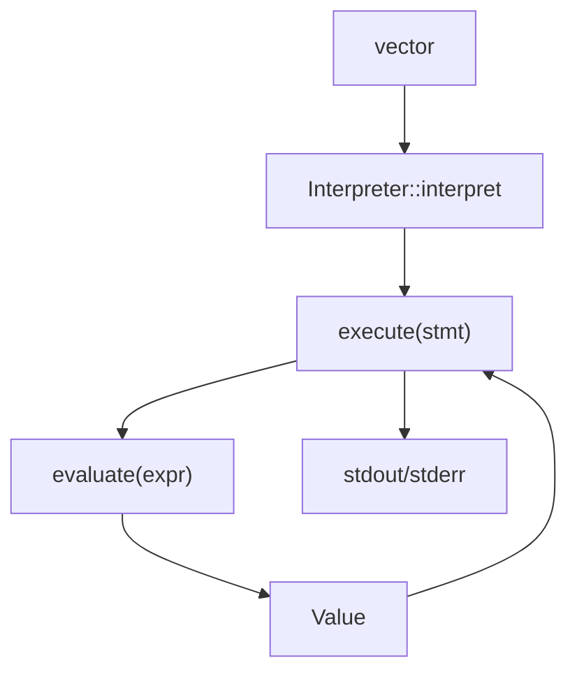

# Interpreter Module (`interpreter/`)

This document explains Litecode's tree-walk runtime engine.

After parsing and resolving, this module executes the program by traversing AST nodes and evaluating expressions/statements.

For overall architecture, see [../README.md](../README.md).

---

## 1) Runtime Responsibilities

The interpreter module is responsible for:
- executing statements (`print`, `var`, `if`, loops, blocks, etc.)
- evaluating expressions (arithmetic, logic, function/class calls)
- managing environments/scopes at runtime
- implementing functions, closures, classes, instances, inheritance
- reporting runtime errors with source line info

---

## 2) Files in This Module

```text
interpreter/
  inc/
    Environment.hpp
    Interpreter.hpp
    LoxCallable.hpp
  src/
    Environment.cpp
    Interpreter.cpp
    LoxCallable.cpp
```

### `Environment.*`
Runtime scope chain:
- `define(name, value)`
- `get(name)` / `assign(name, value)`
- depth-based `getAt` / `assignAt` for resolver-linked locals

### `Interpreter.*`
Main execution engine:
- `interpret(statements)`
- `execute(stmt)`
- `evaluate(expr)`
- helper semantics (`isTruthy`, `isEqual`, `stringify`)

### `LoxCallable.*`
Callable/object model:
- `LoxCallable` interface
- `LoxFunction` (closures/methods)
- `LoxClass`
- `LoxInstance`

---

## 3) Value System

Runtime `Value` is a `std::variant` containing:
- `nullptr_t` (nil)
- `bool`
- `double`
- `std::string`
- `std::shared_ptr<LoxCallable>`
- `std::shared_ptr<LoxInstance>`

This is the central dynamic value representation.

---

## 4) Runtime Execution Flow



Sequence per statement:
1. identify statement node type,
2. evaluate required expressions,
3. mutate environment/output as needed,
4. continue unless control-flow signal/error occurs.

---

## 5) Expression Semantics

Implemented behavior includes:

- unary `-` and `!`
- numeric binary operators (`+ - * /`) with type checks
- string concatenation via `+` (string + string)
- comparison/equality operators
- logical short-circuit (`and` / `or`)
- variable read/assignment
- function/class call dispatch with arity checks
- property get/set
- `this` and `super`

Runtime type violations raise `RuntimeError` with token context.

---

## 6) Statements and Control Flow

- `ExpressionStmt`: evaluate and discard result
- `PrintStmt`: evaluate and print
- `VarStmt`: define variable with optional initializer
- `BlockStmt`: execute in nested environment
- `IfStmt`: conditional branch
- `WhileStmt`: loop until falsey
- `FunctionStmt`: define function in current environment
- `ReturnStmt`: throw return control signal
- `ClassStmt`: construct class object and bind in environment

---

## 7) Environments and Lexical Scope

`Environment` objects form a linked chain.

Lookup behavior:
- local map first,
- then enclosing scopes recursively,
- else runtime "undefined variable" error.

Resolver-assisted lookup:
- interpreter stores `Expr* -> depth` map,
- local reads/assignments use depth-based access (`getAt`/`assignAt`),
- this preserves lexical binding for closures and methods.

---

## 8) Functions and Closures

`LoxFunction` captures declaration AST pointer + closure environment.

On call:
1. create new call environment enclosing closure,
2. bind parameters to argument values,
3. execute function body,
4. return value or `nil`.

`return` is modeled as non-local control signal (`ReturnSignal`) to unwind nested execution.

---

## 9) Classes, Instances, and Methods

### `LoxClass`
- callable constructor object
- optional superclass link
- method map

### `LoxInstance`
- field storage map
- dynamic property get/set
- method access returns bound function with `this`

### Initializer behavior
- method named `init` is special
- class arity equals initializer arity
- initializer always returns instance (`this`)

### Inheritance and `super`
- methods fallback to superclass chain
- `super.method()` resolves superclass method and binds current `this`

---

## 10) Native Functions

Global environment includes native `clock()`:
- arity `0`
- returns current epoch seconds as `double`
- string form `"<native fn>"`

---

## 11) Runtime Errors and Exit Behavior

`RuntimeError` carries token and message.
`Interpreter::runtimeError()` prints:
- error message
- `[line X]`

At top-level run pipeline, runtime failures are treated as language errors (`65`) in file mode.

---

## 12) REPL Persistence Note

Top-level driver keeps interpreter instance and AST batches across prompt entries.
This enables persistent definitions in REPL but can increase memory usage over very long sessions.

---

## 13) Related Modules

- Lexer: [../lexer/README.md](../lexer/README.md)
- Parser: [../parser/README.md](../parser/README.md)
- Resolver: [../resolver/README.md](../resolver/README.md)
- Tests: [../tests/README.md](../tests/README.md)

---

## 14) Extension Ideas

- richer native library (string/math/list helpers)
- structured runtime diagnostics with stack trace formatting
- configurable numeric formatting
- optional bytecode backend transition adapter layer
