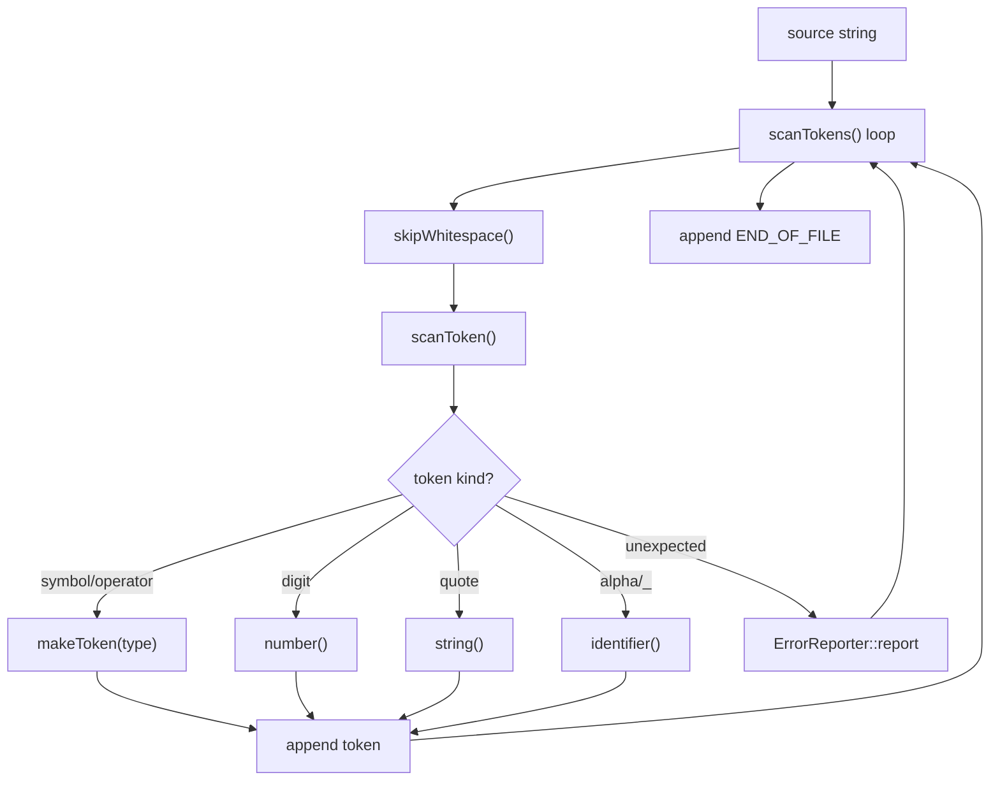

# Lexer Module (`lexer/`)

This document is a deep dive into the **scanner/lexer** stage of Litecode.

If you are new to interpreters:
- this is the first real compiler/interpreter phase,
- it transforms raw source text into typed tokens,
- everything after this (parser, resolver, interpreter) depends on token correctness.

For project-level overview, start with [../README.md](../README.md).

---

## 1) What the Lexer Does

Input:
- plain source code text

Output:
- `std::vector<Token>` ending with `END_OF_FILE`

Responsibilities:
- consume characters left-to-right,
- classify lexemes as token types,
- skip irrelevant text (spaces/comments),
- report lexing errors with line numbers.

---

## 2) Files in This Module

```text
lexer/
  inc/
    ErrorReporter.hpp
    Scanner.hpp
    Token.hpp
    TokenType.hpp
  src/
    Scanner.cpp
```

### `TokenType.hpp`
Defines token categories for:
- punctuation/operators
- literals (`IDENTIFIER`, `STRING`, `NUMBER`)
- keywords (`if`, `for`, `class`, etc.)
- `END_OF_FILE`

Note on naming convention:
- internal enum uses `NILL` and `LEFT_PARENTH` (project convention)
- source language keyword is still `nil`

### `Token.hpp`
Defines `Token` data object carrying:
- token type
- lexeme
- literal payload string
- line number

### `ErrorReporter.hpp`
Static error collector for lexer-phase errors.
Used by scanner to report invalid characters/unterminated strings.

### `Scanner.hpp` + `Scanner.cpp`
Main scanning logic:
- cursor management (`start`, `current`, `line`)
- whitespace/comment skipping
- token construction helpers
- literal and identifier scanners

---

## 3) Scanner Execution Flow



---

## 4) Core Concepts for Beginners

### `start` and `current`
- `start`: beginning of current token lexeme
- `current`: cursor position while consuming characters

On each token scan:
1. skip irrelevant whitespace/comments
2. set `start = current`
3. consume characters according to token rule
4. slice `source.substr(start, current - start)`

### `line` tracking
Whenever newline is consumed, `line++`.
All diagnostics use this value.

### Lookahead helpers
- `peek()`: current char without consuming
- `peekNext()`: one-char lookahead
- `match(ch)`: conditionally consume if next char equals `ch`

This supports two-character operators (`!=`, `==`, `<=`, `>=`) and numeric fractional parts.

---

## 5) Supported Token Patterns

### Single-char tokens
`(` `)` `{` `}` `,` `.` `-` `+` `;` `*` `/`

### Two-char tokens
`!=` `==` `<=` `>=`

### Literals
- numbers: integer and decimal (`123`, `12.34`)
- strings: between double quotes
- identifiers: `[a-zA-Z_][a-zA-Z0-9_]*`

### Keywords
Recognized by identifier lookup map:
- `and`, `class`, `else`, `false`, `for`, `fun`, `if`, `nil`, `or`,
- `print`, `return`, `super`, `this`, `true`, `var`, `while`

---

## 6) Error Behavior

### Unexpected character
Scanner reports error and continues scanning next lexeme boundary.

### Unterminated string
Scanner reports error at current line and continues.

In file mode, lexer errors eventually lead to process exit code `65` via top-level run pipeline.

---

## 7) Practical Example

Source:

```lox
var x = 12.5;
print x + 1;
```

Conceptual token output:

```text
VAR IDENTIFIER EQUAL NUMBER SEMICOLON
PRINT IDENTIFIER PLUS NUMBER SEMICOLON
END_OF_FILE
```

Debug token dump can be enabled from root executable:

```bash
LITECODE_DUMP_TOKENS=1 ./build/litecode sample.lox
```

---

## 8) How Lexer Connects to Next Stages

- Parser consumes token vector.
- Parser assumes token sequence is structurally valid at lexical level.
- Resolver and interpreter never see raw source text.

So scanner bugs can manifest later as parser confusion, which is why this module is foundational.

---

## 9) Related Docs

- Project overview: [../README.md](../README.md)
- Parser details: [../parser/README.md](../parser/README.md)
- Testing details: [../tests/README.md](../tests/README.md)
